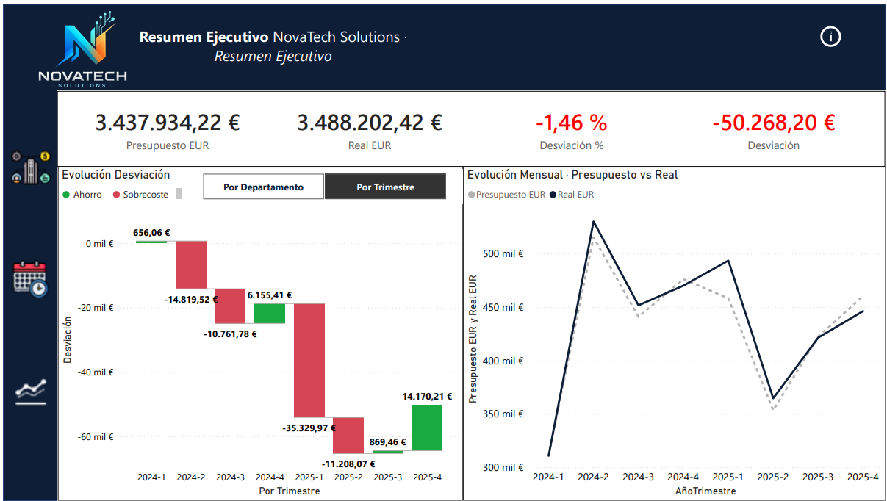
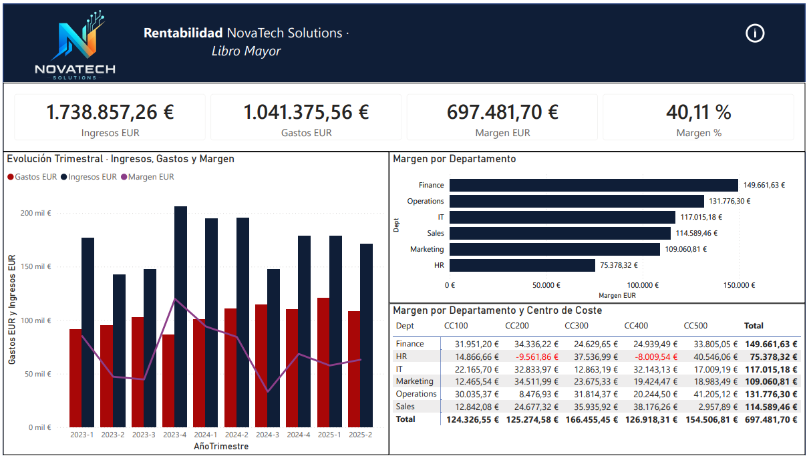
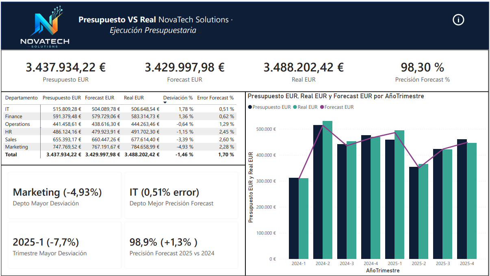
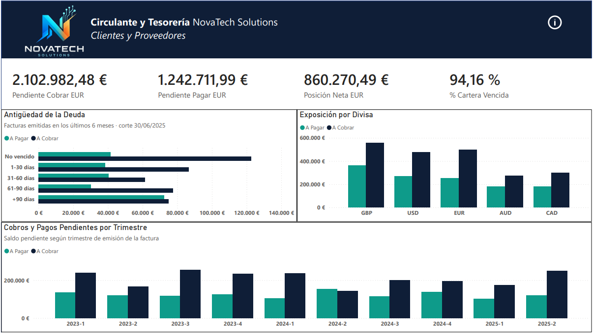
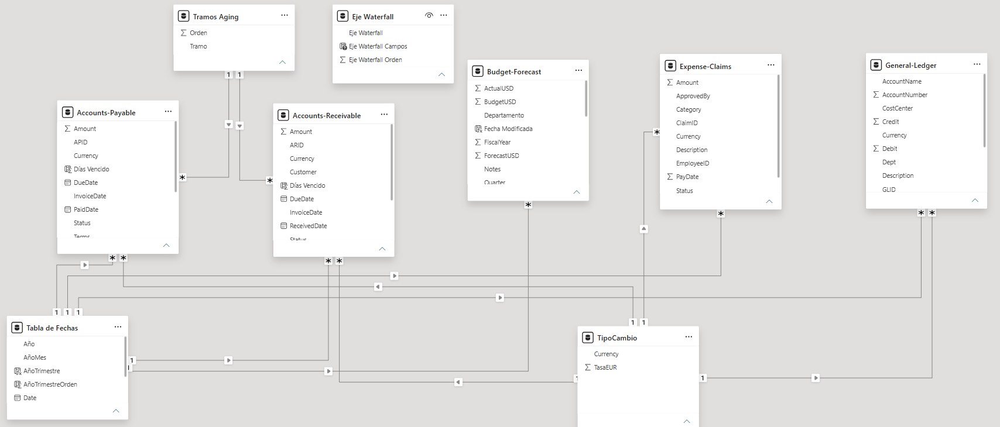

# Control de Gestión en Power BI · NovaTech Solutions

Informe interactivo de control de gestión construido sobre cinco tablas contables:
libro mayor, presupuesto, cuentas a cobrar, cuentas a pagar y notas de gasto.
Cubre el ejercicio 2023 a junio de 2025, con importes en cinco divisas convertidos
a euros.

El objetivo no era hacer gráficos bonitos, sino responder cuatro preguntas de
gestión y dejar documentado de dónde sale cada cifra y hasta dónde llega.

**[▶ Ver el recorrido en vídeo](PENDIEN

TE-ENLACE)** · duración 1 min 30 s

---

## El informe

### 1 · Resumen Ejecutivo



Visión global de la ejecución presupuestaria: cuánto se presupuestó, cuánto se
gastó y dónde se concentra la desviación.

El gráfico de cascada admite dos ejes mediante marcadores — por departamento o
por trimestre — y un tercer botón despliega el comparativo interanual, que
sustituye el gráfico de evolución por la comparación 2025 frente a 2024 y añade
las dos tarjetas de diferencia.

### 2 · Presupuesto vs Real



Detalle por departamento y trimestre, incorporando el **forecast** además del
presupuesto inicial y el dato real. Esa tercera magnitud permite separar dos
preguntas que se suelen confundir:

- **Desviación** — ¿cumplimos el presupuesto?
- **Precisión del forecast** — ¿supimos anticipar que no lo íbamos a cumplir?

Son cosas distintas. Marketing se pasa un 4,93 % del presupuesto, pero solo yerra
un 2,28 % frente a su propia previsión: el problema no es que no sepan lo que van
a gastar, es que el presupuesto se fijó bajo. La precisión global del forecast
mejoró 1,3 puntos de 2024 a 2025.

### 3 · Ingresos y Margen



Ingresos, gastos y margen registrados en el libro mayor, con desglose por
departamento y centro de coste.

El libro mayor contiene tanto cuentas de ingreso como de gasto, y la página usa
las cinco: 4000 y 4010 al Haber como ingresos, 5000, 5010 y 6000 al Debe como
gastos. Quedarse solo con el Debe habría dejado fuera cerca de dos millones de
euros que están en la misma tabla y habría convertido la página en un simple
recuento de gasto, sin margen ni contraste con la facturación.

La matriz cruza departamento y centro de coste y marca en rojo las dos
combinaciones con margen negativo, que son las que pedirían revisión.

### 4 · Circulante y Tesorería



Qué queda por cobrar, qué queda por pagar, qué parte está vencida y cómo se
reparte por antigüedad, divisa y trimestre.

El gráfico de antigüedad revela el hallazgo más claro del informe: la deuda de
clientes decrece según envejece, como es esperable, pero la de proveedores se
mantiene plana en todos los tramos y **se dispara en el de más de 90 días**, hasta
casi igualar a la de cobros. Es el perfil de una empresa que estira el pago a
proveedores para financiarse.

En 2024-Q2 el saldo pendiente de pago superó al de cobro, único trimestre de los
diez en que ocurre.

---

## Modelo de datos



Esquema en estrella. Cinco tablas de hechos cuelgan de una tabla de fechas común
y de una tabla de tipos de cambio, más dos tablas desconectadas que sirven de
dimensión auxiliar.

| Tabla | Filas | Contenido |
|---|---|---|
| General-Ledger | 2.000 | Asientos contables, 5 cuentas, 5 divisas |
| Accounts-Receivable | 900 | Facturas de cliente |
| Accounts-Payable | 800 | Facturas de proveedor |
| Expense-Claims | 1.000 | Notas de gasto de empleados |
| Budget-Forecast | 48 | Presupuesto, forecast y real por departamento y trimestre |
| Tabla de Fechas | — | Dimensión de calendario 2023-2025 |
| TipoCambio | 5 | Tasa a EUR por divisa |
| Tramo Aging | 5 | Dimensión de tramos de antigüedad |
| Eje Waterfall | 2 | Parámetro de campo para el toggle del gráfico de cascada |

### Decisiones de modelado

**Conversión multidivisa.** El libro mayor y las cuentas a cobrar y pagar conviven
en EUR, USD, GBP, CAD y AUD, con la divisa a nivel de fila. La conversión se hace
dentro de la medida, no como columna calculada:

```dax
Ingresos EUR =
SUMX(
    'General-Ledger',
    'General-Ledger'[Credit] * RELATED(TipoCambio[TasaEUR])
)
```

Budget-Forecast es el caso aparte: no tiene columna de divisa porque sus importes
nacen todos en dólares, así que ahí la tasa se busca con `LOOKUPVALUE` fijando
`"USD"` en lugar de recorrer una relación.

**Dimensiones compartidas.** Los gráficos que muestran cobros y pagos en el mismo
eje no pueden apoyarse en una columna de una de las dos tablas: cada tabla de
hechos solo se reparte por su propia columna y la otra serie colapsaría en un
único bloque. Por eso el tramo de antigüedad vive en su propia tabla
(`Tramo Aging`), relacionada uno a varios con ambas, y la divisa se toma de
`TipoCambio` en vez de la columna `Currency` de una factura concreta.

**Fecha de corte fija.** El análisis de antigüedad usa el 30/06/2025, último día
con datos, en lugar de `TODAY()`. Con la fecha real de ejecución todo el histórico
caería en el tramo de más de 90 días y el gráfico dejaría de decir nada.

**Interactividad por marcadores.** Los paneles de filtros, los toggles y el
comparativo interanual funcionan con marcadores acotados a *Pantalla* y a
*objetos visuales seleccionados*. Sin esa doble restricción, un marcador borra los
filtros del usuario al aplicarse y altera la visibilidad de mecanismos que no le
corresponden.

---

## Limitaciones conocidas

Estas notas están también dentro del informe, en el panel de información de cada
página.

**El libro mayor y el presupuesto no reconcilian.** Para el mismo periodo
2024-2025, el «real» de Budget-Forecast asciende a 3,79 M USD frente a 0,77 M de
cargos en el libro mayor: una diferencia de cinco a uno. El reparto por
departamento tampoco coincide — en el presupuesto Marketing es con diferencia el
que más gasta, mientras que en el libro mayor los seis departamentos gastan
prácticamente lo mismo. Son dos tablas independientes del conjunto de datos de
origen; el libro mayor no es la fuente contable de ese presupuesto. Se ha optado
por presentarlas por separado y delimitar el ámbito de cada página desde la
cabecera, en lugar de forzar un cuadre que no existe.

**No hay DSO ni DPO.** Son los indicadores habituales en un análisis de
circulante, pero sobre estos datos no serían métricas sino constantes: todas las
facturas de cliente son a 45 días y todas las de proveedor a 30, y las cerradas
se cobraron o pagaron exactamente en plazo — mínimo, media y máximo coinciden.
Promediar eso devuelve siempre las condiciones contractuales, no un
comportamiento observado. Por el mismo motivo tampoco se calcula el ciclo de
conversión de efectivo, que además exigiría los días de existencias y estas
tablas no incluyen inventario.

**Las facturas parciales se cuentan enteras.** 565 facturas figuran en estado
«Parcial», pero el origen no registra el importe ya liquidado. Se contabilizan por
su importe íntegro, de modo que el saldo pendiente real es algo menor que el
mostrado.

**El 94 % de cartera vencida es acumulación, no política de cobro.** De las 900
facturas de cliente, 599 siguen sin fecha de cobro, muchas emitidas en 2023. Con
la fecha de corte en junio de 2025, casi todo lo que sigue abierto está
necesariamente vencido. El cálculo es correcto y en un entorno real sería un
buen termómetro de la gestión de cobro; sobre estos datos mide otra cosa.

**No hay página de notas de gasto.** La tabla Expense-Claims no presenta
estructura analizable: los importes medios por categoría van de 385 a 412 euros,
las tasas de rechazo por responsable oscilan entre el 26 y el 32 % —ruido en torno
a la media—, los 232 expedientes pagados se liquidaron todos exactamente a 15
días, y el campo de descripción contiene el mismo texto en las 1.000 filas. Una
página sobre esos datos serían cuatro gráficos de barras iguales. Se ha preferido
dejar el informe en cuatro páginas con hallazgos reales.

---

## Contenido del repositorio

```
informe/     Archivo .pbix del informe
datos/       Las cinco tablas de origen en Excel
capturas/    Imágenes de cada página y del modelo de datos
docs/        Detalle de medidas DAX y del modelo
```

El `.pbix` requiere Power BI Desktop para abrirse. Si solo quieres ver el
resultado, el vídeo del encabezado recorre las cuatro páginas y su
interactividad.

---

## Herramientas

Power BI Desktop · DAX · Power Query · Modelado en estrella

---

**Mario Díaz** — Finanzas y control de costes
[mariodipon01@gmail.com](mailto:mariodipon01@gmail.com)
